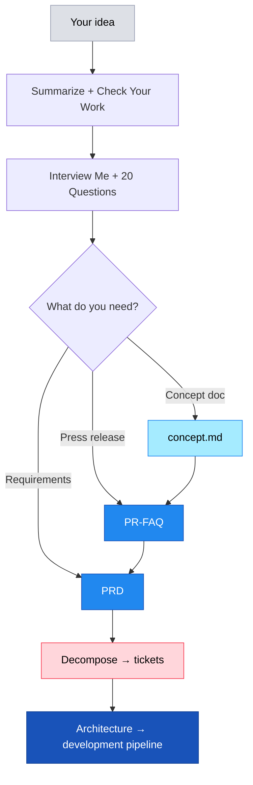
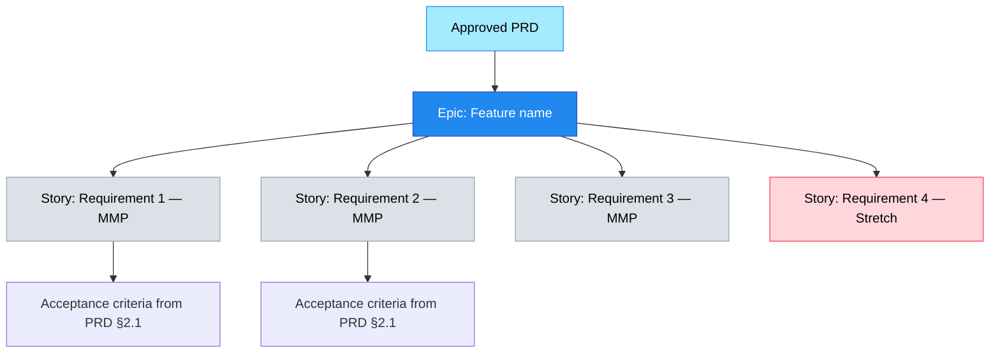

# LLM Prompts for Concept Development

Structured prompts for turning ideas into product artifacts. Use these to go from a vague notion to a `concept.md`, PR-FAQ, or PRD — then decompose into tickets for execution.

> Adapted from *LLM Prompts for Product Managers* by Michael Carpenter. Always follow your organization's generative-AI policy when feeding documents to an LLM.

## How These Prompts Connect



The prompts below build on each other. Use them in sequence to progressively refine your thinking, then feed the output into whatever product-doc tooling your team uses.

---

## Phase 1: Summarization and Analysis

### Getting Up To Speed Quickly

Use this when you have existing documents (specs, requirements, press releases, blueprints) and need to quickly understand what's there.

**Prompt:**

> You are assisting a Product Manager at a software-as-a-service company specializing in APIs. The Product Manager has given you several documents for reference, which may include:
>
> - Technical specifications
> - Requirements and user stories
> - Press releases and FAQs
> - Software blueprints
> - Any other relevant artifacts
>
> Each document may be dozens of pages long. Your task is to produce a concise (1-2 page) structured summary that captures:
>
> 1. The most important points, features, and requirements.
> 2. Any open questions or ambiguities that need clarification.
> 3. Unstated assumptions that could impact product strategy or development.
> 4. Assertions or claims that are not backed by concrete data (call them out with suggestions for how to validate).
> 5. Potential risks or conflicting information across documents.
>
> For every key detail, open question, or assumption, provide a citation in the format: (DocumentName, PageNumber, LineNumber) so it's easy to trace back to the source. If you see contradictory information across documents, note it explicitly with corresponding citations.
>
> IMPORTANT:
> - Rely only on the content provided in these attached documents, or provided URLs
> - Do not hallucinate or invent information that is not directly supported by the materials.
>
> If a particular detail cannot be found in the reference documents, explicitly state that it is not mentioned in the provided materials. Compose the output as a well-organized summary with headings and bullet points. Avoid repetition, use clear language, and stick to the facts. Always ask for clarification rather than making assumptions. If you're having trouble with something, it's ok to stop and ask for help.

### Checking Your Work

Use this when you've written your own documentation and want a rigorous critique before sharing.

**Prompt:**

> You are assisting a Product Manager at a software-as-a-service company specializing in APIs. The Product Manager has provided you with their own internal documentation, representing their own expert work. What they need from you is a thorough critique and consistency check. Specifically, the PM wants:
>
> 1. Identification of any contradictions or inconsistencies within and across the documents.
> 2. Verification that all assertions or claims are clearly supported by data or other evidence — if they are not, call them out and recommend data points or rationale that could strengthen them.
> 3. Recognition of any areas where assumptions are implicitly made but not explicitly stated, or where the logic flow is unclear.
> 4. Suggestions for improvements to wording, structure, or clarity that could help the documents more effectively communicate the product vision.
> 5. A constructive, critical challenge of the ideas: if something can be improved or warrants more detail, note it specifically and explain why.
>
> IMPORTANT:
> - Use references in the format (DocumentName, PageNumber, LineNumber) if you need to pinpoint exact locations.
> - Avoid any hallucination or speculation beyond what is supported by the text.
> - Organize your output as a clear, itemized list of issues, errors, and recommended improvements.
> - Maintain a neutral, professional tone suitable for internal review.
>
> Provide your findings and recommendations in a concise yet thorough manner, focusing strictly on the content at hand and ensuring all feedback is actionable. Always ask for clarification rather than making assumptions. If you're having trouble with something, it's ok to stop and ask for help.

---

## Phase 2: Idea Generation

### Interview Me

Use this to stress-test your product thinking before writing anything formal. The LLM plays a tough tech reporter and turns the interview into a structured FAQ.

**Prompt:**

> You are acting as a seasoned technology reporter from a respected publication that caters to domain experts. You have scheduled an in-depth interview with a Product Manager who has just launched a new SaaS product specializing in APIs. During the interview, your goals are to:
>
> - Challenge the PM on their product's capabilities, limitations, adoption strategy, budget and pricing structure, roadmap, customer support commitments, etc.
> - Ask for supporting data, user insights, and real-world examples that back up any claims or assertions.
> - Explore future plans, potential pitfalls, and compare this tool to competing solutions.
> - Uncover the product's intended audience and how it addresses their specific pain points.
> - Provide a complete picture that helps your expert readers evaluate the product's genuine value.
>
> At the conclusion of the interview, you will:
>
> 1. Transform the conversation into a formal, business-style FAQ.
> 2. Remove the casual Q&A tone and instead present the final output as a well-structured, neutral, and concise FAQ document.
> 3. Organize the FAQ with clear headings or sections (e.g., Product Overview, Capabilities and Features, Pricing, Data/Performance Benchmarks, Limitations and Future Roadmap), ensuring each question is followed by a succinct yet thorough answer.
> 4. Strictly avoid any speculation or details not clearly established in the PM's statements — no hallucinations.
>
> Keep a balanced approach: while you're asking challenging questions, aim for a constructive and professional tone. Embed specifics, references to data points (if provided), and verifiable examples wherever possible. Always ask for clarification rather than making assumptions. If you're having trouble with something, it's ok to stop and ask for help.

### 20(0) Questions

Use this for iterative product specification development. The LLM asks one question at a time, building on each answer until you have a complete spec.

**Prompt:**

> You are acting as an experienced innovation coach and product ideation partner for a Product Manager. Together, we want to develop a thorough, step-by-step specification for a new product (or feature). Your goal is to ask me one single question at a time. Each question should:
>
> - Build on my previous response, progressively refining and expanding the product specification.
> - Challenge my assumptions and encourage me to think critically about every facet — strategy, feasibility, usability, risk, etc.
> - Cover the full breadth of product design, including user experience, technical architecture, data requirements, business model, security, and compliance considerations.
>
> By the end of our iterative Q&A, we should have a well-defined spec I can hand off to a developer. Remember:
>
> - Only pose one question at once.
> - Base each new question on the answer I just provided.
> - Avoid giving any solutions or direct advice; focus on asking open-ended, in-depth questions.
>
> Let's proceed one step at a time. Ask the first question now, and we'll keep iterating until we have a comprehensive product specification.
>
> Here's the idea: \<YOUR IDEA HERE\>

---

## Phase 3: Product Artifact Creation

After running through Phases 1-2, you have rich context. Now turn it into formal artifacts.

### Option A: `concept.md`

For ideas that aren't ready for a formal PR-FAQ yet, write a concept doc:

```
"Take everything we've discussed and write a concept.md that captures
the problem, the proposed solution, key technical decisions, and what
success looks like. Keep it under 2 pages."
```

The concept doc becomes the input to your architecture/design step.

### Option B: PR-FAQ — Press Release / FAQ

For ideas ready for stakeholder alignment, co-author a PR-FAQ. An interview-driven session works well:
- Read your `concept.md` if present
- Explore the codebase for technical grounding
- Interview you one question at a time
- Produce a PR-FAQ following your team's template

A good PR-FAQ includes a press release narrative, customer FAQs, internal FAQs, and a "code reality check" appendix that grounds claims in actual code.

### Option C: PRD — Product Requirements Document

For features moving into build, create a PRD that:
- Takes an optional PR-FAQ as input (recommended — creates continuity)
- Explores the codebase to ground requirements in reality
- Interviews you on functional requirements, non-functional requirements, user flows
- Tags each requirement with effort estimates (S/M/L/XL)
- Follows your team's PRD template

---

## Phase 4: PRD to Ticket Decomposition

Once your PRD is approved, decompose it into actionable tickets.

### Automated Decomposition

Ask Claude to read your PRD and create tickets:

```
"Read the PRD at <path/to/prd.md> and decompose it into epics and stories
in the <YOUR-PROJECT> project. Each story should have:
- Clear acceptance criteria from the PRD's functional requirements
- Story points based on the PRD's effort estimates (S=2, M=5, L=8, XL=13)
- Labels: 'from-prd', the feature name
Create an epic first, then stories linked to it."
```

### What Gets Created



If your toolchain has a ticketing integration (e.g. a Jira MCP server or plugin), point Claude at it to create epics/stories, update fields, assign sprints, and search for duplicates before creating new tickets.

### Example Workflow

```
1. PR-FAQ "Call Quality Dashboard"        ← Creates PR-FAQ
2. PRD "Call Quality Dashboard"            ← Creates PRD from PR-FAQ
3. Review + approve PRD with stakeholders
4. "Decompose the approved PRD into tickets in <YOUR-PROJECT>"
5. Claude reads PRD, creates epic + stories with acceptance criteria
6. "Assign all MMP stories to the next sprint"
7. Architecture → development pipeline begins
```

---

## The Full Journey

```mermaid
flowchart LR
    subgraph "Think"
        A["Idea"] --> B["Summarize existing docs"]
        B --> C["Interview Me / 20 Questions"]
    end
    subgraph "Define"
        C --> D["concept.md"]
        D --> E["PR-FAQ"]
        E --> F["PRD"]
    end
    subgraph "Plan"
        F --> G["Decompose → tickets"]
        G --> H["Sprint planning"]
    end
    subgraph "Build"
        H --> I["Architect → dev → validate → review → ship"]
    end

    style A fill:#DDE0E6,color:#000,stroke:#9AA0B4
    style D fill:#A5EBFF,color:#000,stroke:#2188EF
    style E fill:#2188EF,color:#fff,stroke:#1953B9
    style F fill:#2188EF,color:#fff,stroke:#1953B9
    style G fill:#FFD6DB,color:#000,stroke:#F83D53
    style I fill:#1953B9,color:#fff,stroke:#0E3E92
```



## Caveats

These prompts are **augmentation strategies** — they help you get past the blank cursor, produce higher quality first drafts, and think more rigorously. They are not a replacement for critical analysis, domain expertise, or stakeholder judgment. Don't be a passive conduit between the LLM and documents you present as your own work. Use these to think better, not to think less.
