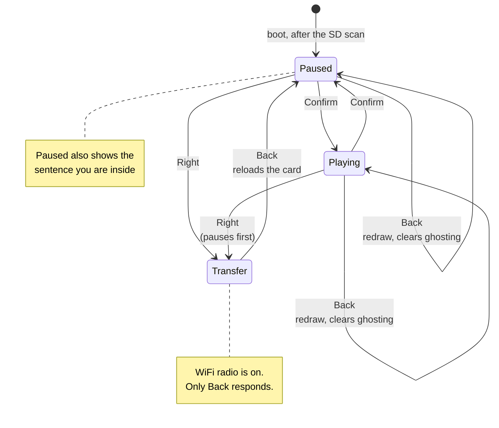

# Controls

Every control the reader firmware implements, read off `firmware/reader/src/main.cpp`
rather than remembered. If a behaviour is not in this document, the firmware does not have
it.

## Quick reference

| Button | While reading | While in WiFi transfer |
|---|---|---|
| **Confirm** | Play / pause | *ignored* |
| **Left** | Rewind to the start of the sentence. Press again to step into the previous one | *ignored* |
| **Up** | Speed up, +30 WPM | *ignored* |
| **Down** | Slow down, −30 WPM | *ignored* |
| **Right** | Enter WiFi transfer mode | *ignored* |
| **Back** | Redraw the screen, which also clears ghosting | **Leave transfer mode** |
| **Power** | *nothing — not handled by this firmware* | *nothing* |

Speed is clamped to **60–900 WPM**. The panel cannot present faster than about 330 WPM in
three-word chunks, so numbers above that change the display without changing the pace.

## The two modes

## What each one actually does

**Confirm — play / pause.** The reader boots paused, so this is the button that starts it.
Pausing does more than stop the text: it draws the whole sentence you are currently inside,
underneath the reading band. Pausing is what you do when you have lost the thread, and the
surrounding sentence answers that more cheaply than rewinding through it.

**Left — rewind by sentence.** Jumps to the first word of the sentence you are in. Press it
again and it steps into the sentence *before* that, rather than sticking. This is deliberate
and is the feature the project cares most about: suppressing the backward glance is the one
thing RSVP inherently does to a reader, and it measurably costs comprehension.

**Up / Down — speed.** ±30 WPM per press. The status line shows the current figure. Because
the panel's refresh floor is 542 ms, three words per update caps out near 330 WPM — asking
for more will not go faster, but asking for less genuinely does slow down.

**Right — WiFi transfer.** Pauses reading, brings up an access point, and shows a screen
with the network name, password and address. The radio is the largest single power draw on
a 650 mAh cell, so it only runs while this screen is up.

**Back — redraw.** Forces a full refresh. Useful when ghosting has built up and you do not
want to wait for the automatic flush. In transfer mode this is the only button that
responds, and it drops the radio and reloads the card.

## What is not implemented

Worth stating plainly, because these are the things people reasonably expect:

- **No long press, and no press-and-hold, anywhere.** Every handler in the firmware reads a
  rising edge — the instant a button goes down. Holding a button does nothing that tapping
  it does not. The input library does expose a held-time, and nothing uses it.
- **The Power button does nothing.** The firmware never reads it. Whatever it does is
  between the hardware and the bootloader, not this firmware.
- **No bookmark, no table of contents, no chapter jump.** Position is saved automatically,
  but there is no way to move by more than a sentence.
- **No way to pick a book on the device.** It opens the first `.rsvp` it finds at the root
  of the card, else the first `.txt`, else a built-in passage. Books inside folders are not
  found — the scan does not descend.

## Finding the buttons

The firmware names buttons `Back, Confirm, Left, Right, Up, Down, Power`. Those names come
from the community SDK's input library, which reads them off two resistor ladders on ADC
pins. **Nothing in the code or the SDK documents where they physically sit on the device** —
that mapping exists only in the plastic.

If you need to identify one, the fastest way is by behaviour:

- **Confirm** is the only button that makes the text start advancing on its own.
- **Right** is the only one that changes the whole screen to the WiFi transfer page. Back
  gets you out of it.
- **Up** and **Down** change the WPM number on the status line.
- **Left** jumps the text backwards.
- **Back** redraws without changing anything.

Every one of them is harmless, so pressing them to find out costs nothing but a refresh.
