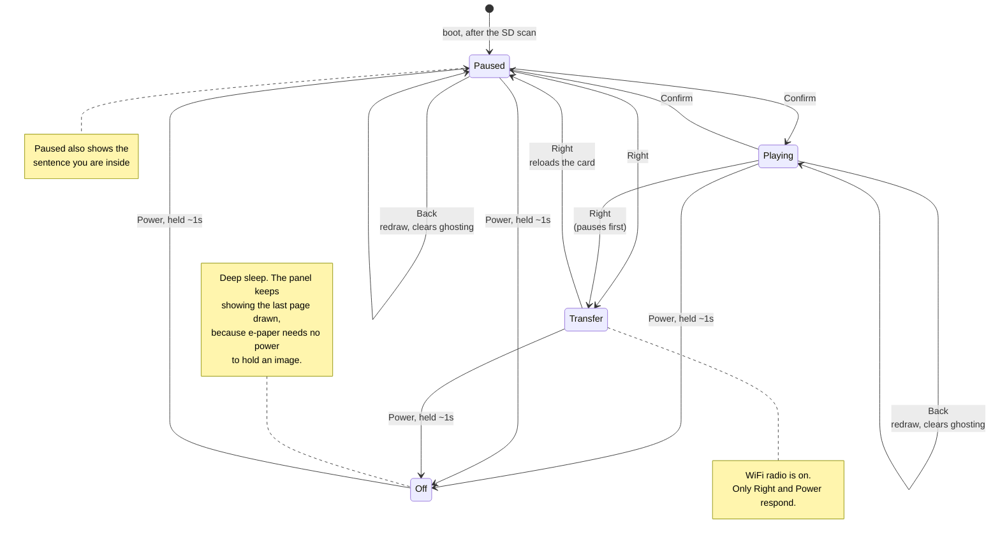

# Controls

Every control the reader firmware implements, read off `firmware/reader/src/main.cpp`
rather than remembered. If a behaviour is not in this document, the firmware does not have
it.

## Quick reference

| Button | While reading | While in WiFi transfer |
|---|---|---|
| **Confirm** | Play / pause | *ignored* |
| **Left** | Rewind to the start of the sentence. Press again to step into the previous one | *ignored* |
| **Up** | Speed up, +30 WPM | *ignored* |
| **Down** | Slow down, −30 WPM | *ignored* |
| **Right** | Enter WiFi transfer mode | **Leave transfer mode** |
| **Back** | Redraw the screen, which also clears ghosting | *ignored* |
| **Power** | **Hold ~1s to switch off.** Hold ~1s again to switch back on | **Hold ~1s to switch off** |

Speed is clamped to **60–900 WPM**. The panel cannot present faster than about 330 WPM in
three-word chunks, so numbers above that change the display without changing the pace.

## The two modes



## What each one actually does

**Confirm — play / pause.** The reader boots paused, so this is the button that starts it.
Pausing does more than stop the text: it draws the whole sentence you are currently inside,
underneath the reading band. Pausing is what you do when you have lost the thread, and the
surrounding sentence answers that more cheaply than rewinding through it.

**Left — rewind by sentence.** Jumps to the first word of the sentence you are in. Press it
again and it steps into the sentence *before* that, rather than sticking. This is deliberate
and is the feature the project cares most about: suppressing the backward glance is the one
thing RSVP inherently does to a reader, and it measurably costs comprehension.

**Up / Down — speed.** ±30 WPM per press. The status line shows the current figure. Because
the panel's refresh floor is 542 ms, three words per update caps out near 330 WPM — asking
for more will not go faster, but asking for less genuinely does slow down.

**Right — WiFi transfer, in and out.** Pauses reading, brings up an access point, and
shows a screen with the network name, password and address. The radio is the largest single
power draw on a 650 mAh cell, so it only runs while this screen is up. Pressing Right again
drops the radio, reloads the card, and returns to reading — one button, one job, and the
same button both ways so there is nothing to remember.

The page lists what is on the card, and every entry is a link: tapping one reads the file
back out through the browser. That is how `battery.csv` leaves the device, and it is the
only way to read a run made with the cable out without opening the case to find the card.

**Power — off and on.** Hold for about a second and release. The reading position is saved
first, and the panel is given a clean full refresh before sleeping: e-paper holds its image
with no power, so whatever was drawn last is what you see while the device is off. Hold it
again for about a second to wake. A brief press while asleep is ignored on purpose -- the
wake source is a level on a pin, so a pocket would otherwise switch the device on.

**Back — redraw.** Forces a full refresh. Useful when ghosting has built up and you do not
want to wait for the automatic flush. In transfer mode it does nothing: the only two
buttons that respond there are Right, which leaves, and Power, which switches off.

## What is not implemented

Worth stating plainly, because these are the things people reasonably expect:

- **Power is the only button with a hold gesture.** Every other handler reads a rising
  edge — the instant the button goes down — so holding them does nothing that tapping does
  not.
- **A tap during a refresh is dropped.** Button edges are only sampled once per loop, and a
  refresh blocks for 542ms or 1958ms. A press that begins and ends inside that window is
  never seen. Press deliberately, or hold until the screen responds.
- **No bookmark, no table of contents, no chapter jump.** Position is saved automatically,
  but there is no way to move by more than a sentence.
- **Peak ghosting cannot be inspected on the device.** Every button handler ends in a full
  refresh, including pause — so the one action that would freeze the panel mid-accrual is
  also the one that clears it. To photograph ghosting at its worst, wait out the cycle
  rather than pausing: a full refresh is visibly a flash, and the panel is most ghosted
  about thirty-five seconds after one ends.
- **No way to pick a book on the device.** It opens the first `.rsvp` it finds at the root
  of the card, else the first `.txt`, else a built-in passage. Books inside folders are not
  found — the scan does not descend.

## Finding the buttons

The firmware names buttons `Back, Confirm, Left, Right, Up, Down, Power`. Those names come
from the community SDK's input library, which reads them off two resistor ladders on ADC
pins, and nothing in the code or the SDK records where they physically sit. Established by
handling the device, 2026-09-20, with the panel in its shipped landscape orientation:

```
        [P]   [ Vol +/- ]
     +---------------------------------+
     | agents.rsvp                     |
     | 330 wpm  12%                    |
     |              |                  |  [ ]  <- upper rocker
     |       the quick brown           |  [ ]
     |              |                  |  [ ]  <- lower rocker
     |                                 |  [ ]
     +---------------------------------+
```

**Three physical controls, seven logical buttons.** Power is a single button; everything
else is a rocker, pressed at one end or the other. That is why the SDK reports seven — it
is not a generic count across a product family, it is this device:

| Physical | Where | Logical |
|---|---|---|
| Power | top edge, solo, leftmost | `Power` |
| Volume rocker | top edge, right of Power | `Up` / `Down` |
| Upper rocker | right edge, under the thumb | two of `Back`/`Confirm`/`Left`/`Right` |
| Lower rocker | right edge, below it | the other two |

- **Top edge: Power, then the volume rocker**, above the corner where the document name is
  drawn. The rocker is what the firmware calls `Up` and `Down` — so the speed control is
  the volume rocker, which is exactly the right place for it on a device held in one hand,
  and is worth treating as a design fact rather than an accident of the SDK's naming.
- **Right edge: two rockers**, clustered around the middle under the thumb, carrying
  `Back`, `Confirm`, `Left` and `Right` between them. **Which end is which is not yet
  recorded** — establish it by pressing and watching the screen rather than by guessing:
  Confirm starts the text advancing, Right switches the whole screen to the transfer page,
  Left jumps the text backwards, and Back redraws without changing anything.

That cluster sits level with the reading band, which is why the reading screen carries no
button labels: anything drawn there would compete with chunk text for the 500px budget a
chunk has right of the focal column, and chunks need about 400 of it. The labels live on
the sleep screen instead, where there is a whole free panel and the image persists with no
power — see below.

If you need to identify one, the fastest way is by behaviour:

- **Confirm** is the only button that makes the text start advancing on its own.
- **Right** is the only one that changes the whole screen to the WiFi transfer page, and
  pressing it again is what gets you out.
- **Up** and **Down** change the WPM number on the status line.
- **Left** jumps the text backwards.
- **Back** redraws without changing anything.

Every one of them is harmless, so pressing them to find out costs nothing but a refresh.
